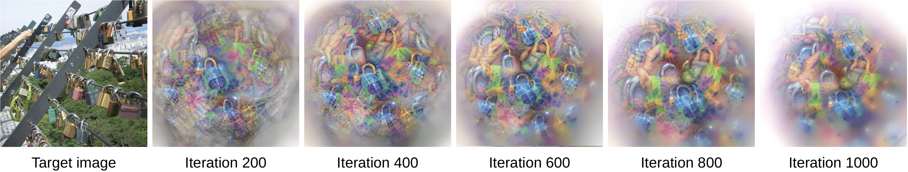

# Class-Agnostic-Feature-Visualisation
PyTorch code for class agnostic feature visualisation


--------------------------------------------------------------------------------

## Abstract
Visual interpretability of Convolutional Neural Networks (CNNs) has gained significant popularity because the complexity of CNNs imposes great challenges for the understanding of their inner workings. Although many techniques have been proposed to visualize class features of CNNs, most of these techniques do not provide a correspondence between inputs and the extracted features in specific layers. This prevents the discovery of stimuli that each layer responds better to. We propose an approach to visually interpret CNN features given a set of images by creating corresponding images that depict the most informative features of a specific layer. Exploring features in a this class-agnostic manner allows for a greater focus on the feature extractor of CNNs. Our method uses on a dual-objective activation maximization and distance minimization loss, without requiring a generator network nor modifications to the original model. This limits the number of FLOPs to that of the original network. We demonstrate the visualization quality on widely-used architectures.

<p align="center">
<i></i>
<br>
<a href="#" target="blank">[arXiv preprint (coming soon)]</a>


<p align="center">



## Dependencies
+ `scipy` (tested with version `1.5.3`)
+ `scikit-image` (tested with version `0.17.2`)
+ `scikit-learn` (tested with version `0.23.2`)
+ `matplotlib` (tested with version `3.3.0`)
+ `seaborn` (tested with version `0.11.0`)
+ `torch` (tested with version `1.7.0`)
+ `PIL` (tested with version `7.2.0`)
+ `opencv` (tested with version `4.3.0`)
+ `imgaug` (tested with version `0.4.0` )

(optional)
+ `robust_loss_pytorch`

## Installation

Please also make sure that `git` is installed in your machine:

```
$ sudo apt-get update
$ sudo apt-get install git
$ git clone https://github.com/alexandrosstergiou/lass-Agnostic-Feature-Visualisation.git
```

## Using the Code

All the code for producing the visualisations is in the `vis.py` file.

The class `VisGeneration` is used for generating images with network features. The class should be initialised based on the following parameters:

+ `features`: A `torch.nn.Sequential` object containing the model to be visualised.
+ `target_channels`: The integer number of channels to be visualised.
+ `clusters`: The integer number of sub-sets/clusters to be used (i.e. facets).
+ `octave`: Dictionary of editable sub-parameters:
  - `scale`: The scale to be used during interpolation w.r.t. the image.
  - `start_lr`: Initial learning rate
  - `end_lr`: Final learning rate value (if same as initial there will be no change in the learning rate). Experiments up to this point only consider (`start_lr`>=`end_lr`).
  - `start_mask_sigma`: Initial standard deviation value for the gradient mask.
  - `end_mask_sigma`: Final standard deviation value for the gradient mask (if same as initial there will be no change in the gradient mask sigma). Experiments up to this point only consider (`start_mask_sigma`>=`end_mask_sigma`).
  - `start_sigma`: Initial Gaussian blur sigma value
  - `end_sigma`: Final Gaussian blur sigma value
  - `start_denoise_weight`: Initial denoising weight (small weights correspond to more denoising ~ smaller similarity to input)
  - `end_denoise_weight`: Final denoising weight
  - `start_lambda`: Initial lambda value used for scaling the regularized layers.
  - `end_lambda`: Final lambda value for regularization. (`start_lambda==end_lambda` would correspond to no change in the regularization scale)
  - `window`: Integer for the size of the window area to be used for cropping.
  - `window_step`: Step for cropping a selected window.
  - `brightness_step`: Integer number of iterations after which a small value in the overall brightness is added.

+ `img_name`: String for the name of the folder containing all the images. This can for example correspond to a specific ImageNet class.
+ `target`: String for the target layer to be visualized. If unsure, use a loop to print all the modules:
```python
for name, module in features.named_modules():
    print(name)
```
+ `penalty`: String for the name of the layer to apply regularisation to.
+ `iterations`: Integer for the total number of iterations.
+ `data_path`: String for the full directory where the images to be used are. (do not include the specific `img_name` folder this is added at the end of the path during the class initialisation)

## Citation
```
To be updated soon
```

## Licence

MIT

## Contact

Alexandros Stergiou

a dot g dot stergiou at uu dot nl (a.g.stergiou@uu.nl)

Any queries or suggestions are much appreciated!
